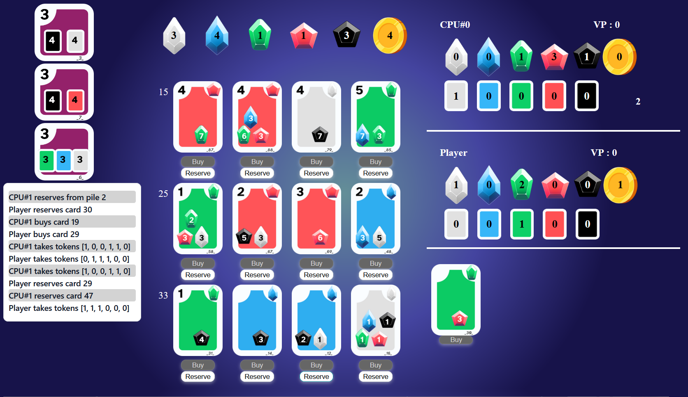

# Splendia

Splendia is a school project made during the spring semester of 2023 at the University of Technology of Belfort Montbéliard. It is a web interface made to play the board game splendor against an AI.



Splendia is decomposed into 2 parts:
- a web interface (i.e., the front-end of the project) found in the "front" repository
- a server containing the model and the AIs of the game (i.e., the back-end of the project) found in the "back" repository

To run Splendia, you need to run both the back-end and the front-end.

# Splendia back-end
Python : 3.10.10

## To run the server
1) Create a python virtual environnement :
```
python -m venv env
```
2) Enter the virtual environnement:
```
source env/bin/activate
```
3) Install the necessary dependancies:
```
pip install -r requirements.txt
```
4) Go into the `back` folder
```
cd back
```
5) Run the server:
```
python run_server.py
```

## To quit the virtual environnement:
```
deactivate
```

## To run tests on the model :
```
python -m unittest -v
```

## To train the AI:
1) Install torch:
```
pip install torch
```
2) Install gymnasium
```
pip install gymnasium
```
3) Run the training script:
```
python traina_i.py
```


# Splendia front-end

This project was generated with [Angular CLI](https://github.com/angular/angular-cli).
Angular CLI: 14.2.11
Node: 16.14

## To run the server

1) Navigate to the `front/splendia` folder
```
cd front/splendia
```
2) Install angular
```
npm install
```
3) Navigate to the `front/splendia/src` folder
```
cd src
```
4) Run the server
```
ng serve
```

# Open the app
Once both python and angular servers are running, got to `http://localhost:4200` to play the game.
